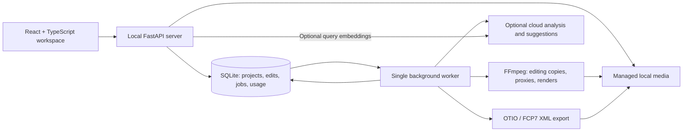

# Storyroom

**Turn a folder of footage into an editable story assembly.**

Storyroom is a local browser workspace for reviewing, finding, and arranging
existing footage before finishing in a professional editor. Start with short
fitness or sports training clips, organize useful moments into a story map,
trim and reorder your selections, then render a review copy or export a cuts-only
timeline intended for DaVinci Resolve.

The creator makes the decisions. Optional AI can describe footage and propose
story sections; accepted edits remain separate from suggestions. The complete
manual workflow runs without a provider account or API key.

**Development preview.** The source is public under MIT. Generated-media tests
exercise the application, but unfamiliar real footage, an actual Resolve import,
and real-provider AI quality remain release gates. See the
[verification record](docs/STATUS.md) for current evidence and limitations.

[Run locally](#run-locally) · [Understand the code](START_HERE.md) ·
[Architecture](docs/ARCHITECTURE.md) · [Roadmap](docs/ROADMAP.md) ·
[Contribute](CONTRIBUTING.md)

## The workflow

1. **Import** a batch of clips. Each file gets its own result and preparation status.
2. **Find moments** by playing footage and searching saved descriptions.
3. **Build a story map** with editable sections, such as preparation, technique,
   progression, and recovery. A moment can appear in multiple sections.
4. **Shape the assembly** by trimming frame ranges, reordering clips, and adding
   creative notes. Save, reopen, or undo board changes.
5. **Review** with sequential playback or a rendered MP4.
6. **Hand off** an FCP7 XML timeline, OTIO file, and media manifest for finishing.

| Capability | Current boundary |
| --- | --- |
| Import and recovery | Per-file outcomes, content-hash deduplication, paused batches, and separate upload/preparation retries |
| Search | Keyword search over stored descriptions; optional embedding search requires cloud setup and footage analysis |
| Story workspace | Custom sections, repeated clip placement, drag/reorder controls, frame trimming, notes, and saved revisions |
| Preview and export | MP4 rendering and cuts-only timeline generation; actual Resolve compatibility still needs an editor import check |
| AI assistance | Provider adapter, validated observations, proposals, cache, and cost ledger implemented; usefulness not yet established |
| Learning to rank | Labeling and grouped evaluation scripts implemented; no trained model is deployed |

## Run locally

The supported user setup is **macOS**, with **Python 3.12**, **Node 22+**, npm,
and FFmpeg/ffprobe installed. Ubuntu CI provides additional automated coverage;
Windows and Linux user installations have not been validated.

The current foundation and media work is on `codex/media-correctness`, under
review in [PR #1](https://github.com/Humza1423/storyroom/pull/1). The checkout below
selects that branch so these instructions match the code; use `main` once merged.

```sh
git clone https://github.com/Humza1423/storyroom.git
cd storyroom
git switch codex/media-correctness
brew install ffmpeg
python3.12 -m venv .tools/uv
.tools/uv/bin/pip install uv==0.12.23
.tools/uv/bin/uv sync --locked --extra dev
npm ci
.venv/bin/python scripts/dev.py
```

Open **[http://127.0.0.1:5173](http://127.0.0.1:5173)** and create a project.
Keep the launch terminal running; Ctrl-C stops the frontend, API, and worker.
No `.env`, API key, or seeded data is required. Opening `index.html` directly or
using VS Code Live Server does not start this application.

For a generated technical demo, stop the launcher, run
`.venv/bin/python scripts/demo.py`, restart, and choose **First assembly · technical
demo**. These test patterns demonstrate application mechanics; they are not sports
footage or evidence of AI quality. Do not run the seeder alongside the worker.

### Make your first assembly

1. Import supported footage or open the technical demo.
2. Preview a moment, then click **Add to section**.
3. Select the placed clip and edit **In · frame** and **Out · frame**. At 30 fps,
   `30 → 90` keeps seconds 1–3: a two-second selection. Click **Apply changes**.
4. Reorder clips and reload the browser to check the saved assembly.
5. Use **Render preview** or **Export to Resolve**; retrieve outputs from
   **Processing & exports**.

Browser playback is approximate. Inspect the rendered output for precise cuts;
verify the exported sequence inside Resolve before relying on its handoff.

## How it is built



The API and worker share one database and media directory. The browser handles
interaction; the backend validates decisions and owns durable state. Keeping
encoding in a separate process lets work continue when the browser closes.

The engineering choices are tied to concrete failure cases:

- **Transactional registration:** an imported asset and its preparation job are
  committed together, so a queue failure cannot leave a stranded asset.
- **Explicit recovery:** each upload has a result; duplicates use file hashes,
  and preparation retries reuse the saved source. Restarting the worker recovers
  interrupted jobs without automatically replaying ambiguous paid requests.
- **Non-destructive editing:** selections store integer frame ranges against
  normalized 30 fps media. Reusing a moment does not duplicate the video file.
- **Safe state changes:** database upgrades have backups and rollback checks;
  asynchronous board saves preserve newer media state in the interface.
- **Isolated verification:** backend and browser tests create temporary projects
  and generated footage. They exercise failure and recovery without using personal
  projects or making paid calls.

Read the [architecture walkthrough](docs/ARCHITECTURE.md) for the data model and
design tradeoffs, or follow one request through the [source map](START_HERE.md).

## Scope and data

- **Input:** SDR H.264 MP4 up to 1080p, including portrait footage; at most
  30 clips, 15 minutes, and 2 GB of source files per project.
- **Storage:** sources are copied into local managed storage and remain unchanged.
  Editing copies, smaller proxies, database state, and exports stay on your machine.
- **Handoff:** timelines reference local normalized editing copies. Camera-original
  relinking and portable media packaging are not implemented; keep those copies
  in place after export.
- **Output:** review MP4s use a 1280×720 canvas with padding. Transitions, captions,
  music synchronization, multicamera editing, and finishing are outside this release.
- **AI:** explicitly enabled analysis sends reduced-resolution video chunks without
  audio; it does not transcribe speech. Suggestions never replace accepted edits
  automatically. Credentials stay on the backend.

Cloud setup, budget behavior, retry details, backup instructions, and development
commands are in the [development guide](docs/DEVELOPMENT.md). Model identifiers and
prices must be verified before enabling real calls. The local spending ledger is
an application guardrail, not a provider-wide billing limit.

## Quality and next steps

After installing development dependencies:

```sh
.venv/bin/pytest -q
npm run build
npx playwright install chromium
npm run test:e2e
.venv/bin/ruff check server tests scripts --select E9,F63,F7,F82
```

The browser harness owns its test servers and temporary data. Do not point it at
your personal development project. [GitHub Actions](.github/workflows/checks.yml)
runs the automated suite; [STATUS](docs/STATUS.md) records completed checks and
keeps generated-media results separate from real-world validation.

Current media work checks geometry, frame timing, and audio. The following gates
are measured media performance, a coherent real-footage assembly, an actual
Resolve import, and a human-reviewed retrieval benchmark. Broader format support
and custom ranking follow evidence from those checks. See the
[roadmap](docs/ROADMAP.md) and [contribution guide](CONTRIBUTING.md).

## License

[MIT](LICENSE) for application code. Dependency, model, and footage rights are
separate; see [third-party notes](docs/THIRD_PARTY.md). Personal footage, credentials,
databases, exports, and generated training artifacts are excluded from Git.
