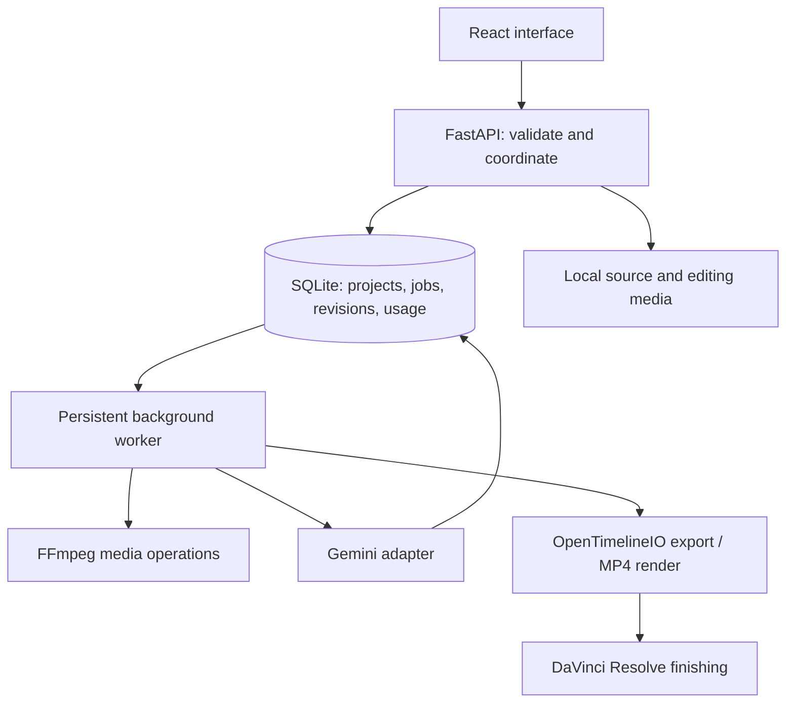

# Understand what you are building

## Follow one action through the application

Suppose you import a clip and add two seconds of it to “Show the work.”

1. **React is the interface.** It sends the file to the local API and displays progress. It does not transcode video or hold your only copy of project data.
2. **FastAPI is the boundary.** It checks file type, limits, and project ownership. It stores a managed source copy, then commits the asset record and normalization job together in one database transaction. A malformed request is rejected before it becomes an edit.
3. **SQLite is the durable memory.** It remembers the asset, pending work, board, and prior revisions. Reloading a browser does not erase them.
4. **The worker handles long operations.** It picks one persistent job at a time. FFmpeg makes a consistent editing copy and smaller preview proxy. A lock prevents two normal workers from simultaneously processing expensive jobs.
5. **A board selection is data.** It contains an asset ID, an in-frame, an exclusive out-frame, and an order. Adding the same source twice creates two selections, not two new video files.
6. **Export interprets those decisions.** OpenTimelineIO produces a timeline; its adapter writes Resolve-importable FCP7 XML. A separate render stitches actual selected ranges for review.

This is non-destructive editing: a decision changes without rewriting the source. That distinction matters more than the AI model.

## Architecture

## Why a worker rather than one long HTTP request?

Video processing takes longer than saving a title. Putting everything in the web request would make browser disconnections, timeouts, and retries hard to reason about. The API instead records a job and returns quickly. The browser polls the database-backed state.

The queue states are queued → running → done/failed/cancelled. On worker restart, interrupted work becomes failed with a retry message. We do not automatically replay paid cloud calls: a timeout can happen after the provider charged you. Completed chunk responses are cached, so explicit retries can reuse them.

The starter uses SQLite rather than Redis/Postgres because there is one local user and one worker. Moving to hosted multi-user processing would require authentication, per-user storage and budgets, a shared job system, and operational monitoring. That complexity does not buy us anything in the local version.

## AI has a narrow job

The AI produces observations and proposed structures. Ordinary code handles IDs, bounds, persistence, cost controls, cancellation, media conversion, and export. A model saying “start at 17 seconds” does not make that a valid timestamp; the application checks it against the source duration.

The pipeline is bounded, not an autonomous agent loop:

`proxy segment → structured observations → description embeddings → candidate retrieval → story proposal → human selection`

An embedding is a numerical representation whose distance can help compare meanings. We compute embeddings once, save them, and compare a query against them. We do not ask a large model to reread every video on every search.

The current retrieval baseline searches descriptions. If the captioner misses a red jersey, text search cannot recover that visual evidence. A direct frame-text encoder such as SigLIP is a separate experiment for fixing that failure, not a reason to rewrite the board or export code.

## Boundaries that prevent expensive bugs

- Asset registration and its normalization job commit together, preventing a partially saved import when queuing fails. See the [transaction lesson](learning/01-import-transactions.md) for the remaining filesystem crash boundary.
- Integer frame boundaries avoid accumulating ambiguous decimal-second rounding through repeated edits.
- Board revision numbers reject stale writes from a second tab instead of silently replacing newer edits.
- Asset IDs restrict media routes to registered files, not arbitrary filesystem paths.
- A hash of input, model, prompt version, and segment content makes repeated analysis reusable.
- Budget reservations happen transactionally before requests; uncertain failures keep their reservation.
- User edits and AI proposals are separate, so regenerating a proposal cannot erase an accepted story.
- The browser's playback is approximate; rendered output and editor import are the precise acceptance checks.

## Learn efficiently while using coding agents

For each feature, insist on four things: a concrete behavior, the smallest implementation, evidence it works, and a short explanation of the tradeoff.

An effective request is: “Add a retry control. Reuse successful media work, do not duplicate selections, and test cancellation followed by retry.” An ineffective request is: “Make the backend production-ready.” The first has observable completion conditions; the second invites unrelated complexity.

Work in vertical slices. A simple import-to-export path reveals media compatibility problems earlier than building every frontend screen before touching the exporter. Once a slice works, improve one bottleneck at a time. Profile before adding infrastructure; measure retrieval before adding models.

Read these entry points in order:

1. `server/models.py`: what valid editing data looks like.
2. `server/app.py`: how an action becomes a request and database change.
3. `server/worker.py`: how slow work progresses and fails.
4. `server/media.py` and `server/exporter.py`: how decisions become actual media/timelines.
5. `server/ai.py` and `server/search.py`: how uncertain model output becomes searchable evidence.
6. `src/main.tsx`: how user interaction connects to those operations.

The interface currently concentrates most behavior in a roughly 1,700-line file.
Splitting its types, API helper, board operations, and feature components is now on
the foundation backlog. Preserve behavior and verify the browser workflow through
that refactor. The database also has initial schema creation and a version marker,
but no upgrade runner yet. Neither limitation should be mistaken for a finished
long-term architecture; see [current status](STATUS.md).

## Your first three exercises

1. Trim a generated clip to frames 5–45. Explain why its duration is 40 frames, not 41. Export and verify.
2. Add a new searchable description without AI. Trace the request, moment row, FTS index, and returned search result.
3. Cancel a processing job and restart the worker. Explain what survives and why paid requests are not replayed automatically.

If you can explain those flows and modify them safely, you are learning the system rather than merely watching code appear.

## Database upgrades

`server/migrations.py` serializes initialization with a file lock and applies ordered
versions inside one exclusive SQLite transaction. Version 1 adopts the existing
schema without rewriting user data. Before a later upgrade, SQLite's backup API
saves the committed database including WAL contents beside the database. Failed
upgrades roll back schema, data, and version together; future schema versions are
refused. Backups are retained, not automatically deleted. Migration functions cannot
commit or use `executescript`, which otherwise implicitly commits the transaction.
