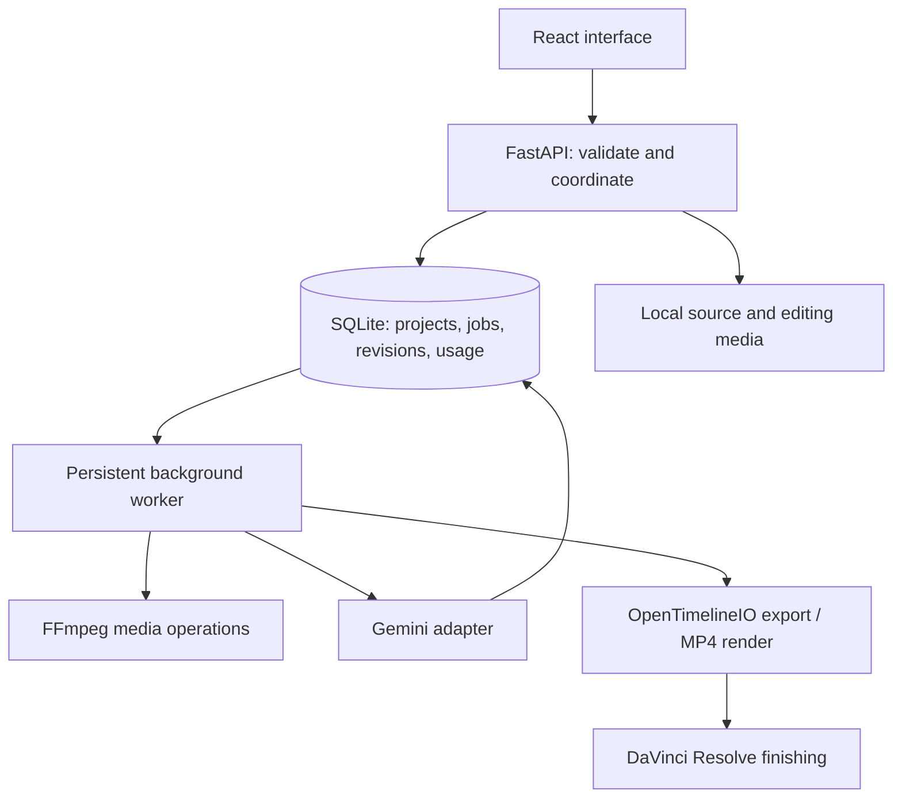

# Understand what you are building

## Follow one action through the application

Suppose you import a clip and add two seconds of it to “Show the work.”

1. **React is the interface.** It sends the file to the local API and displays progress. It does not transcode video or hold your only copy of project data.
2. **FastAPI is the boundary.** It checks file type, limits, and project ownership. It stores a managed source copy, then commits the asset record and normalization job together in one database transaction. A malformed request is rejected before it becomes an edit.
3. **SQLite is the durable memory.** It remembers the asset, pending work, board, and prior revisions. Reloading a browser does not erase them.
4. **The worker handles long operations.** It picks one persistent job at a time. FFmpeg makes a consistent editing copy and smaller preview proxy. A lock prevents two normal workers from simultaneously processing expensive jobs.
5. **A board selection is data.** It contains an asset ID, an in-frame, an exclusive out-frame, and an order. Adding the same source twice creates two selections, not two new video files.
6. **Export interprets those decisions.** OpenTimelineIO produces a timeline; its adapter writes FCP7 XML intended for Resolve. Actual editor import remains an acceptance gate. A separate render stitches actual selected ranges for review.

This is non-destructive editing: a decision changes without rewriting the source. That distinction matters more than the AI model.

## Architecture

## Why a worker rather than one long HTTP request?

Video processing takes longer than saving a title. Putting everything in the web request would make browser disconnections, timeouts, and retries hard to reason about. The API instead records a job and returns quickly. The browser polls the database-backed state.

The queue states are queued → running → done/failed/cancelled. On worker restart, interrupted work becomes failed with a retry message. We do not automatically replay paid cloud calls: a timeout can happen after the provider charged you. Completed chunk responses are cached, so explicit retries can reuse them.

The starter uses SQLite rather than Redis/Postgres because there is one local user and one worker. Moving to hosted multi-user processing would require authentication, per-user storage and budgets, a shared job system, and operational monitoring. That complexity does not buy us anything in the local version.

## AI has a narrow job

The AI produces observations and proposed structures. Ordinary code handles IDs, bounds, persistence, cost controls, cancellation, media conversion, and export. A model saying “start at 17 seconds” does not make that a valid timestamp; the application checks it against the source duration.

The pipeline is bounded, not an autonomous agent loop:

`proxy segment → structured observations → description embeddings → candidate retrieval → story proposal → human selection`

An embedding is a numerical representation whose distance can help compare meanings. We compute embeddings once, save them, and compare a query against them. We do not ask a large model to reread every video on every search.

The current retrieval baseline searches descriptions. If the captioner misses a red jersey, text search cannot recover that visual evidence. A direct frame-text encoder such as SigLIP is a separate experiment for fixing that failure, not a reason to rewrite the board or export code.

## Media coordinates and the shared clock

`server/media.py` prepares new editing copies at 30 fps. The first video timestamp
defines time zero; video and audio lose the same origin. Audio before that origin
is trimmed and delayed audio gets silence, rather than independently resetting
both streams and erasing their relative offset. FFmpeg applies rotation, resizes
using the displayed pixel aspect, then writes square pixels. Editing copies fit
inside 1920-by-1080 in either orientation; playback proxies fit inside 1280-by-720.

Selections use exclusive integer out points. Rendering each range produces a
1280-by-720 padded video part and uncompressed 48 kHz stereo PCM audio. At 30 fps,
each selected frame gets exactly 1,600 audio samples. The concat manifest uses the
saved frame duration, not a container's padded audio duration; final video packets
are copied and AAC is encoded once. Encoding AAC separately at every cut produced
excess audio and irregular video timestamps in the regression fixture.

PCM adds approximately 192 KB of temporary audio per second of assembly, alongside
the encoded video parts. Processing remains sequential. This is a measured
correctness fix, not a performance improvement claim; profiling is the next step.
Existing editing files and selections are not silently rewritten. New imports
and renders use the corrected policy; older copies can retain historical errors.
See [media clocks](learning/02-media-clocks.md) and
[the independent regression tests](../tests/test_media_correctness.py).

## Boundaries that prevent expensive bugs

- Asset registration and its normalization job commit together, preventing a partially saved import when queuing fails. See the [transaction lesson](learning/01-import-transactions.md) for the remaining filesystem crash boundary.
- Worker failure/cancellation commits the job's terminal status and the asset's failed state together, so a retry cannot interleave between those writes and have its newer state overwritten.
- Integer frame boundaries avoid accumulating ambiguous decimal-second rounding through repeated edits.
- Board revision numbers reject stale writes from a second tab instead of silently replacing newer edits.
- Asset IDs restrict media routes to registered files, not arbitrary filesystem paths.
- A hash of input, model, prompt version, and segment content makes repeated analysis reusable.
- Budget reservations happen transactionally before requests; uncertain failures keep their reservation.
- User edits and AI proposals are separate, so regenerating a proposal cannot erase an accepted story.
- The browser's playback is approximate; rendered output and editor import are the precise acceptance checks.

## Learn efficiently while using coding agents

For each feature, insist on four things: a concrete behavior, the smallest implementation, evidence it works, and a short explanation of the tradeoff.

An effective request is: “Add a retry control. Reuse successful media work, do not duplicate selections, and test cancellation followed by retry.” An ineffective request is: “Make the backend production-ready.” The first has observable completion conditions; the second invites unrelated complexity.

Work in vertical slices. A simple import-to-export path reveals media compatibility problems earlier than building every frontend screen before touching the exporter. Once a slice works, improve one bottleneck at a time. Profile before adding infrastructure; measure retrieval before adding models.

Read these entry points in order:

1. `server/models.py`: what valid editing data looks like.
2. `server/app.py`: how an action becomes a request and database change.
3. `server/worker.py`: how slow work progresses and fails.
4. `server/media.py` and `server/exporter.py`: how decisions become actual media/timelines.
5. `server/ai.py` and `server/search.py`: how uncertain model output becomes searchable evidence.
6. `src/App.tsx` and its feature components: how user interaction connects to those operations.

The foundation extracted types, API helpers, board operations, and feature components
from the original large entry file. App still coordinates the project and dialogs.
The database now has a transactional migration runner and consistent backups. See
the detailed boundaries below and [current status](STATUS.md) for verified results.

## Your first three exercises

1. Trim a generated clip to frames 5–45. Explain why its duration is 40 frames, not 41. Export and verify.
2. Add a new searchable description without AI. Trace the request, moment row, FTS index, and returned search result.
3. Cancel a processing job and restart the worker. Explain what survives and why paid requests are not replayed automatically.

If you can explain those flows and modify them safely, you are learning the system rather than merely watching code appear.

## Database upgrades

`server/migrations.py` serializes initialization with a file lock and applies ordered
versions inside one exclusive SQLite transaction. Version 1 adopts the existing
schema without rewriting user data. Before a later upgrade, SQLite's backup API
saves the committed database including WAL contents beside the database. Failed
upgrades roll back schema, data, and version together; future schema versions are
refused. Backups are retained, not automatically deleted. Migration functions cannot
commit or use `executescript`, which otherwise implicitly commits the transaction.

## Frontend boundaries

`main.tsx` mounts `App.tsx`. Shared API shapes live in `types.ts`; `lib/api.ts`
handles the local request header, structured HTTP errors, and bounded timeouts.
Library cards, board rows/sections, pure placement moves, and the preview player
live under `features/`; processing controls live under `components/`. App keeps
project orchestration and draft form state. Saved boards/revisions stay in SQLite.
Project effects discard late responses after selection changes; polling uses an
epoch to avoid replacing a board with a response that crossed a save.
Board-save responses merge only board/revision into the latest React state; they
must not restore the pre-save snapshot of assets and jobs. Import responses likewise
merge media fields without restoring an older board. Each response updates only
the state it owns, allowing importing and editing to overlap safely.

## Interruption boundary

The launcher checks prerequisites, waits for real HTTP readiness, monitors named
children, and terminates only its own process groups. A second worker acquires no
lock and exits before database recovery can change the first worker's jobs. On
restart, running jobs become failed; unfinished normalization assets become failed
in the same transaction. Explicit retry queues work and restores processing state.
No interrupted paid request is automatically replayed. Tests kill worker process
groups at a controlled encoding boundary, then perform real normalization/render
on retry. An encoding can restart from the beginning; individual media stages are
not resumable. A hard kill may leave temporary/unreferenced files, and killing only
a worker PID can leave its encoder running; use the owning launcher/process group.
Automatic orphan cleanup remains deferred.

## Reproducible contribution checks

Python 3.12 uses `uv.lock` with the dev extra and a pinned setuptools build backend.
A separate `.tools/uv` environment bootstraps the pinned uv installer without changing
system Python. JavaScript uses `npm ci`. FFmpeg/ffprobe are explicit system tools.
The Ubuntu workflow runs fatal-error lint, backend tests, build and isolated browser
checks with empty credentials, unconfirmed pricing and zero subprocess AI budget.
Provider ledger unit tests explicitly use fake clients and a finite test allowance.
The supported user platform remains macOS; external Resolve/provider gates remain.

## Resilient import batches

`features/library/imports/controller.ts` owns browser-only batch state and sequential
dispatch; `ImportPanel.tsx` presents outcomes; `presentation.ts` derives preparation
labels and unique-asset counts. `App.tsx` captures the selected destination and merges
only refreshed assets/moments/jobs. It keeps board revisions and draft forms intact.
`useSyncExternalStore` subscribes React to the controller's immutable snapshots; no
global state library or persistent browser queue was added.

The request flow is File → one import request → atomic asset/job registration →
persistent worker preparation → refreshed asset state. Registration is not proof of
playability. Accepted and invalid rows release their File; recoverable rows retain it
for explicit upload retry. Disposing the controller prevents further dispatch.

Import errors retain `detail` and add `code`, `scope` (`file` or `batch`) and
`uncertain`. Only known file-invalid/file-too-large rejections continue automatically.
Unknown/systemic failures pause conservatively. A timeout may follow a server commit,
so the UI never infers success from a filename; explicit retry uses content hashing.

`server/imports.py` derives each asset's `preparation_job` from all its project's
normalization jobs, exposing only id/status/progress/message. Duplicate imports
return that job ID. Preparation retry checks for a newer pending/completed job under
the write transaction before queuing another, protecting against stale buttons.
These are response/behavior changes; SQLite remains schema version 1.
